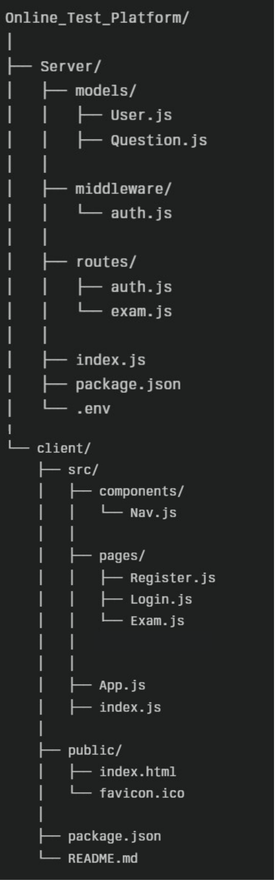

## Table of Contents

- [Project Overview](#project-overview)
- [Features](#features)
- [Technologies Used](#technologies-used)
- [Setup Instructions](#setup-instructions)
- [Running the Application](#running-the-application)
- [Backend API Endpoints](#backend-api-endpoints)
- [Example Postman API Requests & Responses](#example-postman-api-requests--responses)
- [Postman Collection – Import & Usage Instructions](#postman-collection-import-usage)
- [Frontend Details](#frontend-details)
- [Project Demonstration (Videos & Images)](#project-demonstration-videos--images)
- [Notes](#notes)

***

## Project Overview

This platform provides an exam environment where users:

- Register and login securely using JWT authentication.
- Receive a fixed set of 30 exam questions.
- Answer questions within a timed interface.
- Submit answers to the backend for scoring.
- View detailed results indicating which answers were correct or wrong and their final percentage score.

***

## Features

- User registration and login with password hashing.
- JWT-protected routes for exam questions and submission.
- Fixed 30-question exam for all users.
- Timer countdown with auto-submit on expiration.
- Answer navigation with question-wise selection.
- Backend scoring with detailed feedback per question.
- Responsive UI built with React and Bootstrap.

***

## Technologies Used

- Backend: Node.js, Express.js, MongoDB, Mongoose, bcryptjs, jsonwebtoken, CORS
- Frontend: React.js, Axios, Bootstrap
- Environment variables managed via `.env`


This project uses MongoDB Atlas as a secure, cloud‑hosted database to store user data, exam questions, and results. The backend connects to it via the MONGO_URI in the .env file.

***

## Dependencies

Backend
```json
{
    "bcrypt": "^6.0.0",
    "bcryptjs": "^3.0.2",
    "cors": "^2.8.5",
    "dotenv": "^17.2.1",
    "express": "^4.18.2",
    "express-session": "^1.18.2",
    "jsonwebtoken": "^9.0.2",
    "mongoose": "^8.17.1"
  }
```

Frontend

```json
{
    "@testing-library/dom": "^10.4.1",
    "@testing-library/jest-dom": "^6.6.4",
    "@testing-library/react": "^16.3.0",
    "@testing-library/user-event": "^13.5.0",
    "axios": "^1.11.0",
    "bootstrap": "^5.3.7",
    "react": "^19.1.1",
    "react-dom": "^19.1.1",
    "react-router-dom": "^6.30.1",
    "react-scripts": "5.0.1",
    "web-vitals": "^2.1.4"
  }

```

## Setup Instructions

### 1. Clone the repository

```bash
git clone https://github.com/MALLIKHARJUNCHILUKURI-02/Online-Test-Platform-React-App-.git
cd Online-Test-Platform-React-App-
```

### 2. Backend Setup

```bash
cd Server
npm install
```

- Create a `.env` file in the `Server` folder with:

```
MONGO_URI=<your-mongodb-atlas-connection-string>
JWT_SECRET=<your-secret-key>
PORT=5000

```

- Start the backend server:

```bash
npm start
```

The backend will run on `http://localhost:5000`.

### 3. Frontend Setup

```bash
cd ../client
npm install
npm start
```

The React app will run on `http://localhost:3000`.

***

## Running the Application

1. Open your browser and visit `http://localhost:3000`.
2. Register a new user.
3. Login with your credentials.
4. The exam will start with 30 questions and a timer.
5. Navigate through questions, select answers, and submit before time runs out.
6. View your detailed results and percentage score.

## Running Your Project

### Backend (Server)

1. Navigate to your backend folder:

```bash
cd Server
```

2. Install dependencies:

```bash
npm install
```

3. Ensure your `.env` file exists in the `Server` folder with the following environment variables:

```
MONGO_URI=your_mongo_connection_string
JWT_SECRET=your_jwt_secret_key
PORT=5000
```

4. Start the backend server:

```bash
npm start
```

*Note:* This requires a `"start": "node index.js"` script in your `package.json`.  
By default, the backend server will run at [http://localhost:5000](http://localhost:5000).

***

### Frontend (Client)

1. Navigate to your frontend folder:

```bash
cd client
```

2. Install dependencies:

```bash
npm install
```

3. Start the React development server:

```bash
npm start
```

This runs your frontend on [http://localhost:3000](http://localhost:3000) and will usually open the app automatically in your default browser.

***

## Backend API Endpoints

### 1. User Registration

- **POST** `http://localhost:5000/api/auth/register`

Registers a new user with name, email, and password.

***

### 2. User Login

- **POST** `http://localhost:5000/api/auth/login`

Logs in a user with email and password to receive an authentication JWT token.

***

### 3. Fetch Exam Questions

- **GET** `http://localhost:5000/api/exam/questions`

Fetches the fixed set of 30 exam questions for the authenticated user. Requires an `Authorization` header with a Bearer token.

***

### 4. Submit Exam Answers

- **POST** `http://localhost:5000/api/exam/submit`

Submits the user's answers to the exam questions for grading. Requires an `Authorization` header with a Bearer token and a JSON body with the answers mapping question IDs to selected options.

***
### Example Postman API Requests & Responses

### 1. Register

- **POST** `/api/auth/register`
- Body example:

```json
{
  "name": "Alice Example",
  "email": "alice@example.com",
  "password": "password123"
}
```

- Responses:
  - Success: `{ "message": "User registered successfully" }`
  - Email exists: `{ "message": "Email already registered", "redirectTo": "/login" }`
  - Missing fields: `{ "message": "All fields required" }`

### 2. Login

- **POST** `/api/auth/login`
- Body example:

```json
{
  "email": "alice@example.com",
  "password": "password123"
}
```

- Response:

```json
{
  "token": "",
  "user": {
    "id": "user_id",
    "name": "Alice Example",
    "email": "alice@example.com"
  }
}
```

### 3. Fetch Exam Questions

- **GET** `/api/exam/questions`
- Headers: `Authorization: Bearer `
- Response: 30 question objects with `_id`, `question`, and `options`.

### 4. Submit Exam Answers

- **POST** `/api/exam/submit`
- Headers:  
  `Authorization: Bearer `  
  `Content-Type: application/json`
- Body example:

```json
{
  "answers": {
    "questionId1": "Answer option",
    "questionId2": "Answer option"
    // ...
  }
}
```

- Response example:

```json
{
  "score": 25,
  "total": 30,
  "details": [
    {
      "question": "Question text",
      "correctAnswer": "Correct option",
      "givenAnswer": "User's option",
      "isCorrect": true
    }
    // ... for all 30 questions
  ]
}
```

***

## 📌 Postman Collection – Import & Usage Instructions

A ready‑to‑use Postman collection file is included in the repository:  
`Online_Test_Platform.postman_collection.json`

This collection contains all API requests for:

- **Register**
- **Login**
- **Fetch Exam Questions**
- **Submit Exam Answers** (with testing tips)

### 1️⃣ Import the Collection in Postman

1. **Open Postman** on your computer.
2. Click the **Import** button (top‑left corner).
3. In the popup, select the **File** tab.
4. Click **Upload Files** and choose the file:  
   `Online_Test_Platform.postman_collection.json` from your cloned repo.
5. Click **Import** — the collection will now appear in your **Collections** sidebar.

### 2️⃣ Running the API Requests

1. **Register** a new user using the `POST /api/auth/register` request.
2. **Login** using the `POST /api/auth/login` request and **copy the JWT token** from the response.
3. For the `GET /api/exam/questions` and `POST /api/exam/submit` requests:  
   - Go to the **Authorization** tab  
   - Choose **Bearer Token**  
   - Paste the copied token into the token field.
4. Click **Send** to execute the request and see the API response.

### 3️⃣ Optional – Using the Suggestion in Submit Route
In the **Submit Exam Answers** request description, you’ll find a tip on:
- Copying the questions from `/api/exam/questions`
- Asking a tool like **ChatGPT** to generate a mix of correct and incorrect answers in JSON format
- Pasting that JSON directly into the request body for realistic testing

***

## Frontend Details

- React app manages user authentication state and token storage.
- Fetches questions and manages timer with state hooks.
- Submits answers with authentication token.
- Displays detailed results with correct/incorrect highlights.
- Uses Bootstrap for UI styling and responsiveness.

***

## Project Demonstration (Videos & Images)


[View Demo Video](https://drive.google.com/file/d/1l4p9WDMGrppyyB9lkMA8vufrUmqrCJ9A/view?usp=sharing)

## Notes

- JWT token must be included in all protected request headers.
- Unanswered questions are considered incorrect during scoring.

***